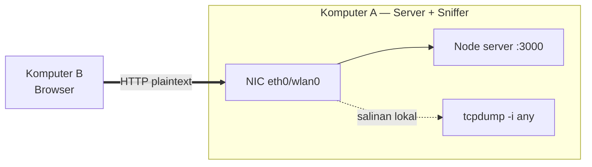
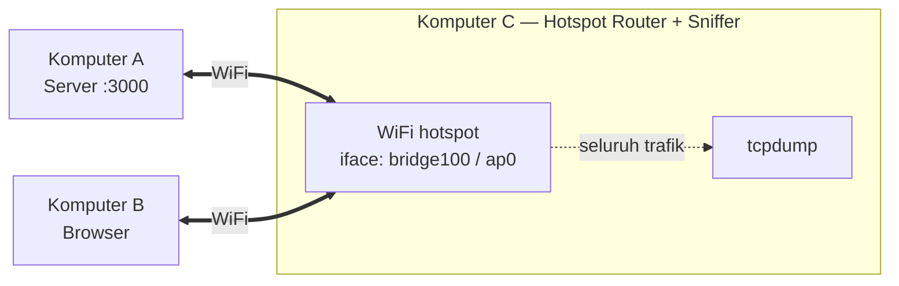
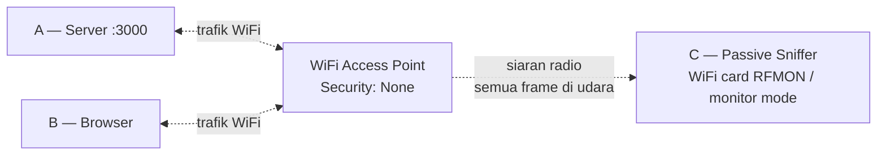
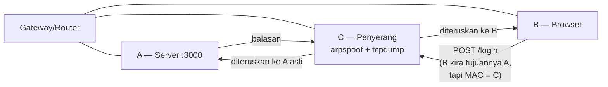
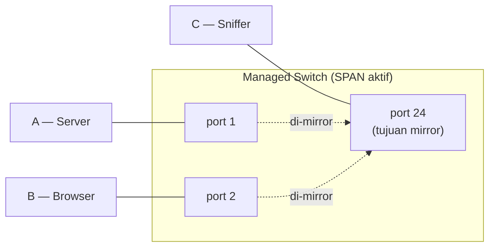

# Demo Login — Packet Sniffing

Aplikasi login HTTP biasa (tanpa TLS) untuk demo packet sniffing. Tujuannya: menunjukkan bahwa form login yang dikirim lewat HTTP gampang dibaca oleh siapa pun yang bisa melihat lalu lintas paket di jalurnya.

## Stack

Vanilla Node.js, tanpa dependency. Cukup Node.js 18+.

## Jalankan server

```sh
node server.js
```

Server akan listen di `http://0.0.0.0:3000`. Akses dari browser: `http://localhost:3000/login`, atau dari laptop lain di LAN: `http://<ip-laptop-dosen>:3000/login`.

Akun untuk demo:
- `admin` / `rahasia123`
- `mahasiswa` / `network2026`

Login berhasil maupun gagal sama-sama menampilkan halaman hasil yang juga mencetak ulang isi body POST — jadi mahasiswa langsung lihat data apa saja yang baru saja dikirim.

## Pilihan tool capture

Tiga tool untuk sniffing. Cukup pilih salah satu, ganti `-i <interface>` sesuai skenario di bawah.

### tcpdump (output teks di terminal)

```sh
sudo tcpdump -i <iface> -A -s 0 -nn 'tcp port 3000'
```

Filter agar hanya paket yang ada payload-nya (skip handshake dan ACK kosong):

```sh
sudo tcpdump -i <iface> -A -s 0 -nn 'tcp port 3000 and (((ip[2:2] - ((ip[0]&0xf)<<2)) - ((tcp[12]&0xf0)>>2)) != 0)'
```

### Wireshark (GUI, paling enak untuk demo kelas)

1. Mulai capture pada interface yang sesuai (lihat skenario di bawah).
2. Display filter: `tcp.port == 3000 and http.request.method == POST`
3. Klik kanan pada paket POST → **Follow → HTTP Stream** → username dan password kelihatan utuh.

### ngrep (one-liner cepat)

```sh
sudo ngrep -d <iface> -W byline 'username|password' port 3000
```

## Lima skenario topologi 3-komputer

Konfigurasi yang dipilih tergantung peralatan dan tujuan pembelajaran. Peran tetap: **A = server**, **B = browser client**, **C = sniffer**.

---

### Skenario 0 — Sniffer satu komputer dengan server atau client

Tidak butuh komputer ketiga. Komputer A (server) sekaligus menjalankan tcpdump. Gunanya untuk membuktikan konsep dasarnya sebelum mahasiswa pusing dengan setup multi-komputer.



**Di komputer A:**
```sh
# Terminal 1
node server.js

# Terminal 2
sudo tcpdump -i any -A -s 0 -nn 'tcp port 3000'
```

B membuka `http://<IP-A>:3000/login`, log sniff langsung muncul di terminal 2.

Variasi paling minimal: A sekaligus jadi B (browser ke `localhost` di komputer yang sama, sniff interface `lo`). Paling cepat di-setup, tapi paling artifisial — paketnya tidak benar-benar lewat network fisik. Cocok sebagai pemanasan untuk membaca output tcpdump sebelum lanjut ke setup multi-komputer.

**Edukasi**: bukti bahwa isi body HTTP terbaca penuh. **Realisme**: rendah, karena di dunia nyata penyerang bukan pemilik server atau client.

---

### Skenario 1 — C menjadi hotspot router

C membuat WiFi hotspot. A dan B sama-sama connect ke hotspot itu. Karena C bertindak sebagai router fisik untuk subnet hotspot, seluruh trafik A↔B otomatis melewati C — tidak perlu trik ARP apa pun.



**Bikin hotspot di C:**

- **macOS**: System Settings → General → Sharing → Internet Sharing. From: koneksi yang sudah ada (WiFi/Ethernet). To: Wi-Fi. SSID = `DemoSniff`, Security: **None (open)**. Interface yang muncul biasanya `bridge100`.
- **Linux**: `sudo apt install -y linux-wifi-hotspot`, lalu `sudo create_ap wlan0 eth0 DemoSniff` (terbuka) atau `sudo create_ap wlan0 eth0 DemoSniff <password>` (WPA2).

**Sniff di C:**
```sh
sudo tcpdump -i bridge100 -A -s 0 -nn 'tcp port 3000'
# Linux: -i ap0
```

A dan B connect ke SSID `DemoSniff`. A menjalankan server. B membuka `http://<IP-A-di-hotspot>:3000/login`. C melihat 100% trafiknya.

**Sebaiknya hotspot dibuat tanpa password** (terbuka) supaya tidak ada enkripsi WPA2 yang menyamarkan apa-apa di udara — mahasiswa langsung melihat plaintext mentah di tcpdump. Skenario ini mensimulasikan rogue hotspot di kafe: penyerang bikin hotspot palsu dengan SSID mirip yang asli, korban iseng nyambung, penyerang ambil semua.

**Edukasi**: yang punya hotspot punya semua visibilitas. **Realisme**: tinggi untuk skenario rogue hotspot, evil twin AP, atau captive portal palsu di tempat umum.

---

### Skenario 2 — Passive monitor mode di WiFi terbuka

WiFi tanpa enkripsi (Security: None — seperti di kafe, hotel, bandara, sebagian lab kampus). C tidak jadi router, tidak ARP spoof, tidak mengganggu trafik A↔B sama sekali. Cukup duduk diam dan menangkap frame radio dari udara. Karena WiFi-nya tidak terenkripsi, isi frame 802.11 langsung terbaca tanpa perlu menurunkan session key dari handshake.



C tidak melakukan associate ke AP — cukup men-tune kartu WiFi ke channel yang dipakai A dan B, lalu menerima semua frame yang lewat. Tidak ada catatan di log AP, korban tidak tahu sedang disadap.

**Cek WiFi yang sedang dipakai (macOS):**
```sh
system_profiler SPAirPortDataType | grep -A 5 "Current Network"
# Lihat baris "Security:". Kalau "None", berarti terbuka — pas untuk skenario ini.
```

**Setup C di macOS:**
```sh
# Cara yang masih jalan di macOS modern: tcpdump -I
sudo tcpdump -I -i en0 -w open-wifi-capture.pcap

# Buka hasilnya di Wireshark setelah selesai capture:
wireshark open-wifi-capture.pcap
# Display filter: tcp.port == 3000 and http.request.method == POST
```

Atau langsung dari Wireshark di macOS:
- Capture Options → pilih interface `en0` → centang **Capture packets in monitor mode** → Start.

**Setup C di Linux:**
```sh
sudo apt install -y aircrack-ng

# Aktifkan monitor mode di wlan0 → muncul interface baru wlan0mon
sudo airmon-ng check kill        # matikan NetworkManager/wpa_supplicant yang bisa mengganggu
sudo airmon-ng start wlan0

# Samakan channel dengan AP target (cek dari system_profiler atau iw)
sudo iw dev wlan0mon set channel 36

sudo tcpdump -i wlan0mon -A -s 0 'tcp port 3000'
# atau buka Wireshark, pilih wlan0mon
sudo wireshark
```

**Hal-hal yang sering jadi masalah:**
- **Kartu wajib mendukung monitor mode (RFMON)**. Sebagian besar kartu WiFi bawaan macOS aman. Untuk Linux/Windows, chipset yang umumnya jalan: Atheros AR9271, Ralink RT3070/RT5572, Realtek RTL8812AU. Adapter populer: Alfa AWUS036NHA, AWUS036ACH, Panda PAU09.
- **Quirk macOS**: begitu `tcpdump -I` aktif di kartu yang sedang terhubung ke WiFi, biasanya koneksi WiFi langsung putus. Solusinya: pakai USB WiFi adapter kedua khusus untuk sniff, atau terima saja koneksi putus selama capture berjalan.
- **Satu waktu satu channel**: kartu WiFi hanya bisa memantau satu channel. Kalau A/B ternyata di channel lain, mereka tidak akan kelihatan. Channel hopping (`airodump-ng` mode auto-hop) bisa dipakai, tapi sebagian frame akan terlewat saat berpindah.
- **Permission macOS Sonoma ke atas**: monitor mode butuh hak akses khusus. Kalau perintahnya gagal, jalankan Terminal dengan **Full Disk Access** dari System Settings → Privacy & Security.
- **Kalau AP-nya pakai WPA2/WPA3**: frame tetap bisa di-capture, tapi isinya terenkripsi. Untuk membuka isinya, tangkap dulu EAPOL 4-way handshake (saat client connect/reconnect), lalu masukkan PSK di Wireshark Preferences → Protocols → IEEE 802.11 → Edit Decryption Keys.

**Edukasi**: paling jelas memperlihatkan kenapa kombinasi WiFi terbuka + HTTP itu sangat rawan — sniff-nya benar-benar pasif, tidak meninggalkan jejak di mana pun. Korban tidak punya cara untuk sadar sedang disadap. **Realisme**: paling tinggi untuk skenario WiFi terbuka (kafe, public hotspot, captive portal yang belum login).

---

### Skenario 3 — ARP spoofing di LAN yang sama

A, B, dan C semuanya client di WiFi/LAN yang sama, terbuka maupun terenkripsi. C meracuni cache ARP di B sehingga paket B yang seharusnya ke A (atau ke gateway) belok dulu lewat MAC milik C — MITM klasik di Layer 2. Beda dengan Skenario 2, ini bersifat **aktif** dan meninggalkan jejak di tabel ARP B yang kalau diperiksa terlihat mencurigakan.



**Setup C** (Linux/macOS) — pakai `bettercap`, paling rapi:
```sh
brew install bettercap            # macOS
sudo apt install -y bettercap     # Linux

sudo bettercap -iface wlan0
# di prompt interaktif:
> set arp.spoof.targets <IP-B>
> set arp.spoof.fullduplex true
> arp.spoof on
> set net.sniff.filter "tcp port 3000"
> set net.sniff.verbose true
> net.sniff on
```

Atau pakai cara klasik:
```sh
# Terminal 1 — aktifkan IP forwarding, kalau tidak trafik B akan drop
sudo sysctl -w net.ipv4.ip_forward=1
# Linux. Untuk macOS: sudo sysctl -w net.inet.ip.forwarding=1

# Terminal 2 — bilang ke B bahwa A ada di MAC C
sudo arpspoof -i wlan0 -t <IP-B> <IP-A>

# Terminal 3 — bilang ke A bahwa B ada di MAC C (dua arah)
sudo arpspoof -i wlan0 -t <IP-A> <IP-B>

# Terminal 4 — capture
sudo tcpdump -i wlan0 -A -s 0 -nn host <IP-B> and tcp port 3000
```

**Yang sering bikin gagal:**
- Banyak router rumah/kantor mengaktifkan **AP isolation / client isolation** → trafik antar client diblokir → ARP spoof tidak akan tembus. Tes dulu dari C: `ping <IP-B>`. Kalau tidak ada jawaban, berarti isolation sedang aktif.
- Kalau A bukan di subnet yang sama dan diakses lewat gateway, cukup C melakukan spoof ke IP gateway saja — sudah cukup untuk MITM trafik keluar dari B.
- Kartu WiFi C harus mendukung promiscuous capture untuk verifikasi. Kartu bawaan macOS aman; sebagian USB adapter butuh driver tambahan.

**Edukasi**: di WiFi publik (kafe, bandara, hotel) yang terenkripsi sekalipun, sesama client masih bisa di-MITM lewat ARP karena enkripsi WiFi hanya melindungi udara, bukan komunikasi antar client di LAN yang sama. Ini inti pelajaran kenapa HTTPS tidak boleh opsional. **Realisme**: tinggi — persis seperti di dunia nyata pada jaringan yang belum mengaktifkan client isolation atau Dynamic ARP Inspection.

---

### Skenario 4 — Port mirror di managed switch

Switch L2 dengan dukungan SPAN/RSPAN. Admin mengatur switch supaya trafik di port A (dan/atau B) di-duplikasi ke port lain tempat C nyolok. C lalu sniff seperti biasa — dapat visibilitas penuh tanpa mengubah jalur trafiknya.



**Contoh konfigurasi switch (Cisco IOS):**
```
monitor session 1 source interface Gi0/1 both
monitor session 1 source interface Gi0/2 both
monitor session 1 destination interface Gi0/24
```

**Sniff di C:**
```sh
sudo tcpdump -i eth0 -A -s 0 -nn 'tcp port 3000'
```

**Catatan:**
- Tidak realistis untuk demo kelas — managed switch dengan SPAN umumnya tidak ada di lab biasa.
- Tetap penting disebut karena begini cara IDS/IPS/NPM legitimate (Splunk, Suricata, Zeek, ntopng) dipasang di production. Mirror port = visibilitas penuh tanpa mengubah jalur trafik produksi.
- Variasi hardware: **network TAP** = splitter fisik (optical/copper) yang lebih reliable dibanding SPAN karena tidak ikut membebani CPU switch. Dipakai di forensics datacenter dan kepatuhan PCI-DSS/HIPAA.

**Edukasi**: visibilitas legitimate untuk operasional/security ops, bukan untuk menyerang. **Realisme**: tinggi di lingkungan enterprise; rendah untuk demo kelas karena butuh peralatan.

---

## C sebagai VirtualBox VM di Windows host (setup mahasiswa)

Setup yang dipakai mahasiswa: **laptop Windows + VirtualBox + Ubuntu VM**. Komputer C (sniffer) dijalankan sebagai Ubuntu VM karena tooling sniff di Linux jauh lebih lengkap (airmon-ng, bettercap, ettercap, tcpdump bawaan, Wireshark) dan permission-nya jauh lebih simpel dibanding di Windows.

Bridge mode = VM dapat IP DHCP sendiri di LAN, dan dari sudut pandang WiFi router VM terlihat sebagai perangkat terpisah dari Windows host-nya.

### Yang harus disiapkan di Windows

1. **VirtualBox** versi terbaru (minimal 7.0).
2. **VirtualBox Extension Pack** (gratis untuk pemakaian edukasi) — wajib supaya USB 2.0/3.0 passthrough dan filter USB bisa jalan. Download dari `https://www.virtualbox.org/wiki/Downloads`, dobel klik file `.vbox-extpack`-nya untuk install.
3. Cek pemasangannya: VirtualBox → File → Tools → Extension Pack Manager. Harus muncul "Oracle VM VirtualBox Extension Pack".
4. **Ubuntu VM** sudah jadi (Desktop atau Server, minimal 22.04 LTS).

### Set bridge mode di VirtualBox (Windows host)

1. Matikan VM.
2. Pilih VM di VirtualBox Manager → klik **Settings**.
3. **Network → Adapter 1**:
   - **Enable Network Adapter**: ✓
   - **Attached to**: `Bridged Adapter`
   - **Name**: pilih interface WiFi Windows host (misal `Intel(R) Wi-Fi 6 AX201 160MHz`). Daftarnya diambil VirtualBox dari driver Windows.
   - **Advanced**:
     - **Adapter Type**: biarkan default `Intel PRO/1000 MT Desktop`.
     - **Promiscuous Mode**: `Allow All`. Ini wajib supaya VM bisa menerima frame yang bukan ditujukan ke MAC-nya (penting untuk Skenario 3).
     - **Cable Connected**: ✓
4. Klik **OK** untuk menyimpan.
5. Nyalakan VM, login ke Ubuntu, buka terminal:
   ```sh
   ip addr show                  # cek IP dari DHCP
   ip route show                 # cek default gateway
   ping <IP-Windows-host>        # pastikan tembus ke host
   ping 8.8.8.8                  # pastikan internet jalan
   ```

VM sekarang sudah punya IP di subnet WiFi LAN yang sama dengan Windows host, dan bisa dijangkau dari laptop lain di LAN itu.

### Install tooling di Ubuntu VM

```sh
sudo apt update
sudo apt install -y tcpdump wireshark ngrep aircrack-ng bettercap dsniff iproute2
# dsniff = paket yang berisi arpspoof, aircrack-ng = airmon-ng/airodump-ng
```

Saat install Wireshark akan ada pertanyaan "Should non-superusers be able to capture packets?" — pilih **Yes** supaya nanti tidak perlu sudo. Setelah itu:
```sh
sudo usermod -aG wireshark $USER
```
Logout lalu login lagi supaya keanggotaan grup-nya aktif.

### Skenario mana yang bisa dari Ubuntu VM bridge mode (Windows host)

| Skenario | Cukup bridge mode? | Catatan |
|---|---|---|
| 0 — co-located | YA | Server (`node server.js`) dan sniffer sama-sama di VM, sniff `enp0s3`. Browser bisa di Windows host: `http://<IP-VM>:3000`. |
| 1 — C jadi hotspot | TIDAK | Hotspot butuh kartu WiFi dalam mode AP, dan ini tidak bisa dilakukan lewat virtual NIC bridge. Solusinya: passthrough USB WiFi adapter yang mendukung mode AP. |
| 2 — passive monitor di WiFi terbuka | TIDAK (lewat WiFi bawaan laptop) | VirtualBox bridge ke WiFi bawaan hanya meneruskan frame Ethernet, bukan frame 802.11. Solusinya: passthrough USB adapter yang mendukung monitor mode. |
| 3 — ARP spoofing | YA | Serangan Layer 2. VM punya MAC sendiri (cek di `ip link`). Bettercap dan arpspoof jalan normal. Baca catatan di bawah. |
| 4 — port mirror SPAN | YA, asal Windows host nyolok ke port mirror via Ethernet (bukan WiFi), VM bridge ke adapter Ethernet itu, dan Promiscuous: Allow All. |

### Catatan khusus Skenario 3 dari VM Windows+Ubuntu

ARP spoof dari VM yang di-bridge ke WiFi host kadang gagal karena **driver WiFi di Windows umumnya tidak mengizinkan banyak MAC dari satu interface fisik**. VirtualBox biasanya menyiasati dengan rewrite frame di sisi host, tapi sebagian driver dan router tetap menolak. Tes dulu sebelum demo:

```sh
# Di Ubuntu VM, scan ARP di LAN:
sudo arp-scan --interface=enp0s3 --localnet
# Harus muncul daftar IP+MAC peer (laptop lain di WiFi, Windows host, gateway).

# Tes ping ke peer:
ping <IP-laptop-mahasiswa-lain>
# Kalau dapat balasan, ARP spoof bisa dicoba.
# Kalau timeout, kemungkinan AP-nya pakai client isolation — tidak ada solusi dari sisi software.
```

Kalau bridge ke WiFi memang bermasalah: pakai **Ethernet** untuk bridge VM (kalau ada switch antar laptop), atau gunakan host-only network plus kabel crossover Ethernet untuk demo dua laptop saja.

### USB passthrough untuk Skenario 2 (passive monitor)

Untuk Skenario 2 dari VM, **wajib pakai USB WiFi adapter eksternal** yang mendukung monitor mode. Kartu WiFi bawaan laptop biasa tidak meneruskan radio layer ke VM lewat bridge VirtualBox.

**Adapter yang dukungannya bagus di Ubuntu:**
- **Alfa AWUS036NHA** — chipset Atheros AR9271, driver sudah bawaan kernel, paling stabil.
- **Alfa AWUS036ACH** — chipset Realtek RTL8812AU, dual-band 5 GHz, kadang perlu install driver DKMS.
- **Panda PAU09** — chipset Ralink RT5572, dual-band, harganya terjangkau.
- **TP-Link TL-WN722N v1** — chipset AR9271, sama dengan Alfa NHA. Hanya versi v1, karena v2 dan v3 sudah ganti chipset yang tidak mendukung monitor mode.

**Langkah:**

1. Colok USB adapter ke laptop Windows. Windows mungkin akan menginstall driver default — abaikan saja, biarkan.
2. VirtualBox Manager → pilih VM → **Settings → USB**:
   - **Enable USB Controller**: ✓
   - **USB 3.0 (xHCI) Controller**: ✓ untuk adapter USB 3.0, atau USB 2.0 (EHCI) untuk adapter USB 2.0.
3. Klik ikon **Add Filter from list** (ikon USB dengan tanda plus) → pilih USB WiFi adapter dari daftar perangkat yang terdeteksi (contohnya muncul sebagai `ATHEROS_AR9271`).
4. Klik **OK** untuk menyimpan filter.
5. Nyalakan VM. Cek di Ubuntu:
   ```sh
   lsusb                            # cari Atheros / Ralink / Realtek
   ip link                          # interface baru muncul, biasanya wlx<mac> atau wlan0
   sudo iw list | grep -A 3 "Supported interface modes" | grep monitor
   # baris yang muncul harus berisi "* monitor"
   ```
6. **Matikan WiFi adapter di Windows host** supaya tidak rebutan channel. Internet di Windows bisa pakai Ethernet, sementara USB adapter dipakai eksklusif untuk sniff di VM. Atau biarkan keduanya hidup kalau cuma untuk passive monitor di channel yang berbeda dari koneksi internet.
7. Di Ubuntu VM:
   ```sh
   # Cari channel target dulu:
   sudo iw dev wlan0 scan | grep -E "SSID|freq|signal" | head -20
   # alternatif: lihat channel WiFi saat ini dari properti adapter di Windows host

   sudo airmon-ng check kill                # matikan NetworkManager yang sering mengganggu
   sudo airmon-ng start wlan0               # interface wlan0mon akan dibuat
   sudo iw dev wlan0mon set channel 36      # ganti channel sesuai AP target
   sudo tcpdump -i wlan0mon -A -s 0 -nn 'tcp port 3000'
   # atau buka Wireshark langsung di VM
   ```

### Susunan demo 3-mahasiswa (semua pakai Windows+Ubuntu VM)

Ideal: tiga mahasiswa, masing-masing dengan laptop Windows + Ubuntu VM bridge mode di WiFi lab yang sama. Pembagian perannya:

- **Mahasiswa A (Server)**: jalankan `node server.js` di Ubuntu VM, lihat IP VM dengan `ip addr show`, kasih tahu IP-nya ke yang lain.
- **Mahasiswa B (Browser)**: pakai browser di Windows host atau di Ubuntu VM, buka `http://<IP-VM-A>:3000/login`, login dengan akun demo.
- **Mahasiswa C (Sniffer)**: tergantung skenario:
  - **Skenario 0** (untuk pemanasan): server dan sniffer dijalankan di VM C, browser juga di VM C. Bukan demo tiga-orang, tapi cara cepat membiasakan diri membaca output tcpdump.
  - **Skenario 3** (ARP spoof): jalankan `bettercap` di Ubuntu VM, set target ke IP B. Begitu B login ke A, paketnya akan muncul di output bettercap pada laptop C.
  - **Skenario 2** (passive monitor di WiFi terbuka): butuh USB Alfa adapter — biasanya cukup satu yang disediakan dosen, dipakai bergiliran tiap kelompok. Colok ke laptop C, passthrough ke VM, lalu jalankan airmon-ng dan tcpdump.

Saran urutannya: mulai dari Skenario 0 (semua mahasiswa coba sendiri-sendiri di laptop masing-masing) → Skenario 3 (berkelompok tiga) → Skenario 2 (dengan adapter yang dipakai bergantian).

### Susunan demo untuk dosen

Cukup satu laptop (Mac, Linux, atau Windows) yang sudah berisi VirtualBox + Ubuntu VM + USB Alfa. Dosen bisa demo semua skenario sendiri di depan kelas, lalu mahasiswa mengulanginya di laptop masing-masing.

---

## Memilih skenario

| # | Topologi | Waktu setup | Yang dipelajari | Realisme |
|---|---|---|---|---|
| 0 | A = server + sniffer | 1 menit | Cara membaca output tcpdump | Rendah |
| 1 | C = hotspot router | 5 menit | Pemilik hotspot = pemilik visibilitas | Tinggi (rogue hotspot, evil twin) |
| 2 | C = passive monitor di WiFi terbuka | 5–10 menit | Sniff pasif yang tidak meninggalkan jejak | Sangat tinggi (serangan WiFi terbuka) |
| 3 | C = client biasa di LAN (ARP spoof) | 10 menit | MITM tanpa hak akses istimewa | Tinggi (bahkan di WiFi terenkripsi) |
| 4 | C = port mirror legitimate | (config switch) | Cara IDS/NPM dipasang di production | Tinggi (lingkungan enterprise) |

Urutan demo yang disarankan:
1. **Skenario 0** dulu — supaya mahasiswa familiar dengan format output tcpdump.
2. **Skenario 2** — paling berdampak: tunjukkan bahwa di WiFi terbuka, penyerang cukup duduk dan dengar, tanpa berinteraksi dengan korban.
3. **Skenario 3** — bahkan di WiFi terenkripsi, sesama client masih bisa di-MITM lewat ARP.
4. **Skenario 1** — variasi: bukannya pasif, penyerang bisa juga jadi hotspot palsu di tempat umum.
5. **Skenario 4** — cukup dibahas secara konsep saat masuk ke topik defensive monitoring (Snort, Suricata, SIEM, network TAP forensics).

## Pelajaran setelah demo

| HTTP polos | HTTPS (TLS) |
|---|---|
| Username dan password tampak apa adanya di hasil sniff | Header dan body terenkripsi; sniffer hanya melihat metadata TLS handshake (SNI, cipher) |
| Cookie session juga bisa dicuri → session hijacking | Cookie tidak terbaca |
| Form upload file juga rawan | Aman selama certificate TLS-nya valid |

Solusi yang sudah dilakukan mahasiswa di sesi 6–7: deploy lewat Netlify dengan SSL otomatis dari Let's Encrypt. Untuk deploy VPS di sesi 13, pakai `certbot` atau reverse proxy seperti Caddy/Traefik yang menangani TLS secara otomatis.

## Cara mencegah

- **Jangan deploy form login di HTTP** — selalu HTTPS, dan redirect 301 dari port 80.
- **Header HSTS** (`Strict-Transport-Security: max-age=31536000; includeSubDomains`) — browser akan menolak fallback ke HTTP.
- **Flag cookie aman** (`Set-Cookie: session=...; Secure; HttpOnly; SameSite=Strict`) — cookie tidak akan dikirim lewat HTTP dan tidak bisa dibaca dari JavaScript.
- **Certificate pinning** untuk aplikasi mobile.
- **DHCP snooping + Dynamic ARP Inspection** di switch — mitigasi ARP spoof (Skenario 3) untuk jaringan kantor.
- **WPA3 SAE** — setiap session punya key unik, sniff WiFi terenkripsi jauh lebih sulit dibanding WPA2-PSK. (Skenario 2 masih jalan kalau WiFi-nya terbuka.)
- **VPN di sisi client** saat di WiFi publik — trafik dari device user ke VPN server sudah terenkripsi, sniffer di kafe cuma melihat ciphertext tunnel.

## File

- `server.js` — single-file Node.js HTTP server (tanpa dependency)
