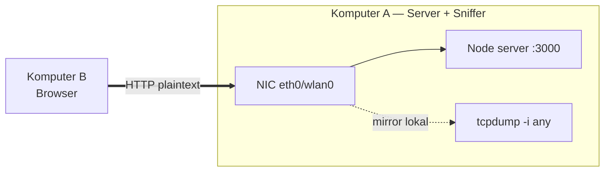
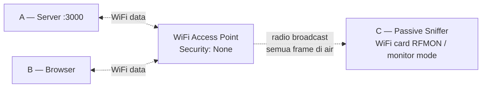
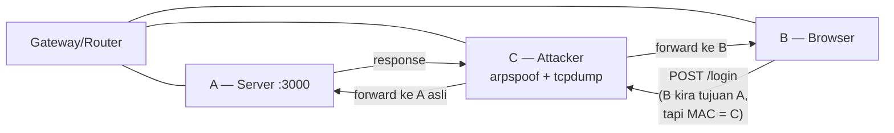
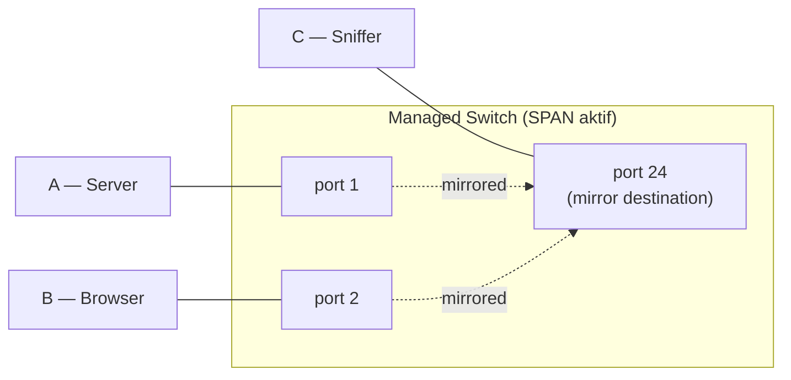

# Demo Login — Packet Sniffing

Aplikasi login HTTP plaintext untuk demonstrasi packet sniffing. Tujuannya menunjukkan bahwa form login yang dikirim via HTTP (bukan HTTPS) bisa dibaca apa adanya oleh siapa pun yang dapat melihat paket di network path.

## Stack

Vanilla Node.js, tanpa dependency. Hanya butuh Node.js 18+.

## Jalankan server

```sh
node server.js
```

Server listen di `http://0.0.0.0:3000`. Akses dari browser: `http://localhost:3000/login` (atau dari mahasiswa lain di LAN: `http://<ip-laptop-dosen>:3000/login`).

Akun demo:
- `admin` / `rahasia123`
- `mahasiswa` / `network2026`

Login salah/benar sama-sama menampilkan halaman hasil yang juga me-echo body POST — jadi mahasiswa langsung lihat data yang dikirim.

## Tools untuk capture

Tiga alternatif perintah sniffing. Tinggal sesuaikan `-i <interface>` per skenario topologi di bawah.

### tcpdump (text dump)

```sh
sudo tcpdump -i <iface> -A -s 0 -nn 'tcp port 3000'
```

Filter agar hanya paket dengan payload (skip handshake/ACK kosong):

```sh
sudo tcpdump -i <iface> -A -s 0 -nn 'tcp port 3000 and (((ip[2:2] - ((ip[0]&0xf)<<2)) - ((tcp[12]&0xf0)>>2)) != 0)'
```

### Wireshark (GUI, paling jelas untuk demo kelas)

1. Start capture pada interface yang sesuai (lihat skenario).
2. Display filter: `tcp.port == 3000 and http.request.method == POST`
3. Pilih paket POST → Right-click → **Follow → HTTP Stream** → username dan password tampak utuh.

### ngrep (one-liner cepat)

```sh
sudo ngrep -d <iface> -W byline 'username|password' port 3000
```

## Skenario topologi 3-komputer

Lima konfigurasi tergantung peralatan dan tujuan pembelajaran. Peran tetap: **A = server**, **B = browser client**, **C = sniffer/monitor**.

---

### Skenario 0 — Sniffer co-located dengan server atau client

Tidak butuh komputer ke-3. Komputer A (server) sekaligus menjalankan tcpdump. Tujuan: pembuktian konsep cepat sebelum ke setup multi-komputer.



**Run di A:**
```sh
# Terminal 1
node server.js

# Terminal 2
sudo tcpdump -i any -A -s 0 -nn 'tcp port 3000'
```

B akses `http://<IP-A>:3000/login`, sniff log muncul real-time di terminal 2.

Variasi paling minimal: A juga jadi B (browser localhost di komputer yang sama, sniff interface `lo`) — paling cepat tapi paling "buatan" karena traffic tidak benar-benar lewat network fisik. Bagus untuk demo step-by-step tcpdump output sebelum lanjut ke setup multi-komputer.

**Pendidikan**: bukti konsep bahwa HTTP body terbaca penuh. **Realism**: rendah — di dunia nyata attacker bukan pemilik server/client.

---

### Skenario 1 — C jadi hotspot router

C membuat WiFi hotspot. A dan B keduanya connect ke hotspot C. Karena C adalah router fisik untuk subnet hotspot, semua traffic A↔B mengalir lewat C secara hardware-level — tidak butuh ARP trick.


**Setup hotspot di C:**

- **macOS**: System Settings → General → Sharing → Internet Sharing. From: koneksi existing (WiFi/Ethernet). To: Wi-Fi. SSID = `DemoSniff`, Security: **None (open)**. Interface yang muncul biasanya `bridge100`.
- **Linux**: `sudo apt install -y linux-wifi-hotspot` lalu `sudo create_ap wlan0 eth0 DemoSniff` (open) atau `sudo create_ap wlan0 eth0 DemoSniff <password>` (WPA2).

**Sniff di C:**
```sh
sudo tcpdump -i bridge100 -A -s 0 -nn 'tcp port 3000'
# Linux: -i ap0
```

A dan B connect ke SSID `DemoSniff`. A jalankan server. B browser ke `http://<IP-A-di-hotspot>:3000/login`. C lihat 100% traffic.

**Saran pakai hotspot tanpa password (open)** supaya tidak ada WPA2 encryption yang menyamarkan apa pun di air — kelas langsung melihat plaintext mentah. Skenario ini mensimulasikan "rogue WiFi hotspot di cafe": attacker buat hotspot palsu dengan SSID mirip, korban connect, attacker sniff semua.

**Pendidikan**: hotspot owner = visibility owner. **Realism**: tinggi untuk skenario rogue hotspot, evil twin AP, captive portal palsu di public space.

---

### Skenario 2 — Passive monitor mode di open WiFi

WiFi terbuka tanpa enkripsi (Security: None — seperti cafe, hotel, bandara, beberapa lab kampus). C tidak menjadi router, tidak melakukan ARP spoof, tidak intervensi apa pun di traffic A↔B. Cukup pasif menangkap radio frame di air. Karena WiFi unencrypted, frame body 802.11 langsung terbaca tanpa perlu derive session key.



C tidak terhubung ke AP secara aktif (tidak associate) — hanya men-tune ke channel yang sama dengan A dan B, lalu menerima semua frame. AP/router tidak tahu C sedang menyadap, tidak ada record di log AP.

**Cek WiFi current security (macOS):**
```sh
system_profiler SPAirPortDataType | grep -A 5 "Current Network"
# Lihat baris "Security:". "None" = open, ideal untuk skenario ini.
```

**Setup C di macOS:**
```sh
# Cara modern: tcpdump dengan flag -I (monitor mode)
sudo tcpdump -I -i en0 -w open-wifi-capture.pcap

# Buka hasil di Wireshark setelah selesai capture:
wireshark open-wifi-capture.pcap
# Display filter: tcp.port == 3000 and http.request.method == POST
```

Atau live di Wireshark (macOS):
- Capture Options → pilih interface `en0` → centang **Capture packets in monitor mode** → Start.

**Setup C di Linux:**
```sh
sudo apt install -y aircrack-ng

# Aktifkan monitor mode pada wlan0 → buat wlan0mon
sudo airmon-ng check kill        # matikan NetworkManager/wpa_supplicant yang bisa interfere
sudo airmon-ng start wlan0

# Pastikan channel match dengan AP target (cek system_profiler / iw)
sudo iw dev wlan0mon set channel 36

sudo tcpdump -i wlan0mon -A -s 0 'tcp port 3000'
# atau
sudo wireshark   # pilih wlan0mon interface
```

**Caveat:**
- **Card harus support monitor mode / RFMON**. Sebagian besar built-in macOS WiFi card OK. Untuk Linux/Windows: chipset yang umum support: Atheros AR9271, Ralink RT3070/RT5572, Realtek RTL8812AU. Adapter populer: Alfa AWUS036NHA, AWUS036ACH, Panda PAU09.
- **macOS quirk**: saat tcpdump `-I` aktif di card yang sedang ter-associate, biasanya WiFi otomatis disconnect. Workaround: pakai USB WiFi adapter kedua khusus untuk sniff, atau accept connection drop selama capture.
- **Channel locking**: WiFi adapter hanya capture satu channel pada satu waktu. Kalau A/B di channel berbeda dari yang dipantau, tidak akan terlihat. Channel hopping (`airodump-ng` auto-hop) bisa, tapi loss frame saat hop.
- **SIP / permission macOS Sonoma+**: monitor mode butuh hak khusus. Kalau gagal, jalankan dari Terminal dengan **Full Disk Access** di System Settings → Privacy & Security.
- **WPA2/WPA3 di AP yang sama**: kalau WiFi terenkripsi, frame masih bisa dicapture, tapi body terenkripsi. Decrypt butuh capture EAPOL 4-way handshake + tahu PSK, lalu Wireshark Preferences → Protocols → IEEE 802.11 → Edit Decryption Keys.

**Pendidikan**: paling jelas memperlihatkan kenapa open WiFi tanpa HTTPS adalah disaster — sniff bersifat **pasif total**, tidak meninggalkan jejak di log AP/server/client. Korban tidak punya cara untuk tahu sedang disadap. **Realism**: paling tinggi untuk skenario open WiFi (cafe, public hotspot, captive portal yang belum auth).

---

### Skenario 3 — ARP spoofing di LAN yang sama

A, B, C semuanya client di WiFi/LAN yang sama (open atau terenkripsi). C meracun ARP cache B supaya paket B yang seharusnya ke A (atau ke gateway) belok lewat MAC C dulu — classic MITM attack via Layer 2. Berbeda dari Skenario 2, ini **aktif** — meninggalkan jejak ARP table mencurigakan di B.



**Setup C** (Linux/macOS) — pakai `bettercap` (paling rapi):
```sh
brew install bettercap            # macOS
sudo apt install -y bettercap     # Linux

sudo bettercap -iface wlan0
# di interactive prompt:
> set arp.spoof.targets <IP-B>
> set arp.spoof.fullduplex true
> arp.spoof on
> set net.sniff.filter "tcp port 3000"
> set net.sniff.verbose true
> net.sniff on
```

Atau pasangan klasik:
```sh
# Terminal 1 — aktifkan forwarding (kalau tidak, traffic B akan drop)
sudo sysctl -w net.ipv4.ip_forward=1
# Linux. macOS: sudo sysctl -w net.inet.ip.forwarding=1

# Terminal 2 — spoof B → A jadi via C
sudo arpspoof -i wlan0 -t <IP-B> <IP-A>

# Terminal 3 — spoof A → B jadi via C (bidirectional)
sudo arpspoof -i wlan0 -t <IP-A> <IP-B>

# Terminal 4 — capture
sudo tcpdump -i wlan0 -A -s 0 -nn host <IP-B> and tcp port 3000
```

**Caveat:**
- Banyak router rumah/kantor mengaktifkan **AP isolation / client isolation** → traffic antar client di-block → ARP spoof tidak akan tembus. Test dulu `ping <IP-B>` dari C: kalau tidak balas, isolation aktif.
- Kalau A bukan di subnet sama (akses lewat gateway), C spoof IP gateway saja sudah cukup untuk MITM traffic keluar B.
- Kartu WiFi C harus support promiscuous capture untuk verifikasi. macOS native WiFi card OK; sebagian USB adapter butuh driver khusus.

**Pendidikan**: di public WiFi (cafe, bandara, hotel) yang terenkripsi sekalipun, peer di WiFi sama bisa MITM via ARP layer 2 — enkripsi WiFi melindungi air, bukan antar client di LAN sama. Inti pelajaran kenapa HTTPS bukan optional. **Realism**: tinggi — exact scenario di dunia nyata pada network yang tidak ada client isolation + DAI.

---

### Skenario 4 — Port mirroring di managed switch

Switch L2 dengan dukungan SPAN/RSPAN. Admin men-config switch supaya traffic di port A (dan/atau B) di-duplikasi ke port C. C colok ke port mirror, sniff seperti biasa — visibility tanpa intervensi traffic path.



**Switch config sample (Cisco IOS):**
```
monitor session 1 source interface Gi0/1 both
monitor session 1 source interface Gi0/2 both
monitor session 1 destination interface Gi0/24
```

**Sniff di C:**
```sh
sudo tcpdump -i eth0 -A -s 0 -nn 'tcp port 3000'
```

**Caveat:**
- Tidak realistic untuk demo kelas — managed switch dengan SPAN tidak ada di lab biasa.
- Penting disebut karena: ini cara legitimate IDS/IPS/NPM (Splunk, Suricata, Zeek, ntopng) deploy di production. Mirror port = visibility full-fidelity tanpa mengubah path traffic produksi.
- Variasi hardware: **network TAP** = splitter fisik (optical/copper) yang lebih reliable dari SPAN karena tidak shared switch CPU. Dipakai di datacenter forensics dan compliance monitoring (PCI-DSS, HIPAA).

**Pendidikan**: visibility legitimate untuk operasional/security ops, bukan attack. **Realism**: tinggi untuk skenario enterprise; rendah untuk demo kelas (perlu peralatan).

---

## Menjalankan C sebagai VirtualBox VM di Windows host (target: laptop mahasiswa)

Setup target: **Windows laptop + VirtualBox + Ubuntu VM**. Mahasiswa pakai Ubuntu VM sebagai komputer C (sniffer) karena Linux punya tooling sniff yang jauh lebih lengkap (airmon-ng, bettercap, ettercap, tcpdump native, Wireshark) dan permission model yang straightforward dibanding Windows host.

Bridge mode = VM mendapat IP DHCP sendiri di LAN, terlihat sebagai peer device terpisah dari Windows host. Dari sudut pandang WiFi router: VM dan Windows host adalah dua machine berbeda.

### Prasyarat di Windows host

1. **VirtualBox** terinstal (versi terbaru, minimum 7.0).
2. **VirtualBox Extension Pack** terinstal (gratis untuk educational use) — wajib untuk USB 2.0/3.0 passthrough dan dukungan USB filter. Download: `https://www.virtualbox.org/wiki/Downloads`. Setelah download `.vbox-extpack`, double-click untuk install.
3. Verifikasi extension pack: VirtualBox → File → Tools → Extension Pack Manager. Harus tampak "Oracle VM VirtualBox Extension Pack".
4. **Ubuntu VM** sudah dibuat (Desktop atau Server, minimum 22.04 LTS).

### Setup bridge mode di VirtualBox (Windows host)

1. Power off VM.
2. Pilih VM di VirtualBox Manager → klik **Settings**.
3. **Network → Adapter 1**:
   - **Enable Network Adapter**: ✓
   - **Attached to**: `Bridged Adapter`
   - **Name**: pilih interface WiFi Windows host (contoh: `Intel(R) Wi-Fi 6 AX201 160MHz`). Daftar interface diambil dari driver Windows.
   - **Advanced**:
     - **Adapter Type**: `Intel PRO/1000 MT Desktop` (default OK)
     - **Promiscuous Mode**: `Allow All` (wajib untuk Skenario 3 ARP spoof — supaya VM bisa terima frame yang bukan untuk MAC-nya)
     - **Cable Connected**: ✓
4. **OK** untuk save.
5. Start VM. Login ke Ubuntu. Buka terminal:
   ```sh
   ip addr show                  # cek IP via DHCP
   ip route show                 # cek default gateway
   ping <IP-Windows-host>        # konfirmasi konektivitas
   ping 8.8.8.8                  # konfirmasi internet
   ```

VM sekarang punya IP di subnet WiFi LAN yang sama dengan Windows host, dan bisa dijangkau dari laptop lain di LAN.

### Install tooling di Ubuntu VM

```sh
sudo apt update
sudo apt install -y tcpdump wireshark ngrep aircrack-ng bettercap dsniff iproute2
# dsniff menyediakan arpspoof, aircrack-ng menyediakan airmon-ng/airodump-ng
```

Saat install wireshark akan ada prompt "Should non-superusers be able to capture packets?" — pilih **Yes** supaya tidak perlu sudo. Logout-login lagi setelah:
```sh
sudo usermod -aG wireshark $USER
```

### Skenario mana yang bisa dari Ubuntu VM bridge mode (Windows host)

| Skenario | VM bridge cukup? | Catatan untuk Windows + Ubuntu VM |
|---|---|---|
| 0 — co-located | YA | VM jalankan server (`node server.js`) + sniff `enp0s3` di VM. Akses dari browser host Windows: `http://<IP-VM>:3000`. |
| 1 — C jadi hotspot | TIDAK | Hotspot butuh WiFi card AP mode → bridged virtual NIC tidak bisa. Solusi: USB passthrough adapter WiFi yang support AP mode. |
| 2 — passive monitor open WiFi | TIDAK (lewat onboard WiFi) | VirtualBox bridge ke onboard WiFi hanya forward Ethernet frame ke VM, bukan radio frame 802.11. Solusi: USB passthrough adapter yang support monitor mode. |
| 3 — ARP spoofing | YA | L2 attack. VM punya MAC sendiri (lihat di `ip link`). Bettercap/arpspoof jalan normal di Ubuntu VM. Lihat caveat di bawah. |
| 4 — port mirror SPAN | YA, kalau Windows host colok ke port mirror via Ethernet (bukan WiFi). VM bridge ke Ethernet adapter Windows, Promiscuous: Allow All. |

### Caveat Skenario 3 dari VM Windows+Ubuntu

ARP spoof dari VM di-bridge ke WiFi host kadang **bermasalah karena WiFi driver Windows tidak izinkan multiple MAC dari satu interface**. VirtualBox biasanya bypass dengan rewrite frame, tapi sebagian driver/router menolak. Test dulu:

```sh
# Di Ubuntu VM, ARP scan LAN:
sudo arp-scan --interface=enp0s3 --localnet
# Harus tampak IP+MAC peer (laptop lain di WiFi, Windows host, router gateway).

# Test ping ke peer:
ping <IP-laptop-mahasiswa-lain>
# Kalau jawaban OK, ARP spoof bisa jalan.
# Kalau timeout, kemungkinan AP client isolation aktif → tidak ada solusi software-side.
```

Kalau bridge ke WiFi bermasalah: gunakan **Ethernet** untuk bridge VM (kalau ada switch antar laptop), atau host-only network + Ethernet crossover untuk demo antar 2 laptop fisik.

### USB passthrough untuk Skenario 2 (passive monitor mode)

Skenario 2 (passive sniff open WiFi) **wajib pakai USB WiFi adapter eksternal** yang support monitor mode, karena chipset onboard WiFi laptop biasa di Windows tidak expose radio layer ke VM via VirtualBox bridge.

**Adapter yang well-supported di Ubuntu**:
- **Alfa AWUS036NHA** (chipset Atheros AR9271) — driver built-in, paling reliable
- **Alfa AWUS036ACH** (Realtek RTL8812AU) — perlu DKMS driver kadang, dual-band 5GHz
- **Panda PAU09** (Ralink RT5572) — dual-band, terjangkau
- **TP-Link TL-WN722N v1** (AR9271, sama chipset Alfa) — versi v1 saja, v2/v3 beda chipset

**Steps:**

1. Colok USB adapter ke Windows host. Windows mungkin install driver dummy — abaikan.
2. VirtualBox Manager → pilih VM → **Settings → USB**:
   - **Enable USB Controller**: ✓
   - **USB 3.0 (xHCI) Controller**: ✓ (kalau adapter USB 3.0; pakai USB 2.0 EHCI kalau adapter USB 2.0)
3. Klik ikon **Add Filter from list** (ikon USB + dengan plus) → pilih USB WiFi adapter dari daftar device terdeteksi (e.g., `ATHEROS_AR9271`).
4. **OK** untuk save filter.
5. Start VM. Verifikasi di Ubuntu:
   ```sh
   lsusb                                    # cari Atheros / Ralink / Realtek
   ip link                                  # interface baru muncul, biasanya wlx<mac> atau wlan0
   sudo iw list | grep -A 3 "Supported interface modes" | grep monitor
   # output harus include "* monitor"
   ```
6. **Disable WiFi adapter di Windows host** supaya tidak ada channel conflict — bisa pakai Ethernet di Windows untuk internet sambil USB adapter exclusively untuk sniff di VM. Atau biarkan dua-duanya aktif kalau hanya passive monitor (channel tidak harus sama dengan koneksi internet).
7. Di Ubuntu VM:
   ```sh
   # Cari channel target dulu:
   sudo iw dev wlan0 scan | grep -E "SSID|freq|signal" | head -20
   # atau dari Windows host, lihat current WiFi channel di Network adapter properties

   sudo airmon-ng check kill                # matikan NetworkManager yang interfere
   sudo airmon-ng start wlan0               # buat wlan0mon
   sudo iw dev wlan0mon set channel 36      # ganti channel sesuai target AP
   sudo tcpdump -i wlan0mon -A -s 0 -nn 'tcp port 3000'
   # atau live di Wireshark VM
   ```

### Setup tipikal demo 3-mahasiswa (semua Windows+Ubuntu VM)

Ideal: 3 mahasiswa, masing-masing Windows laptop dengan Ubuntu VM bridge mode di WiFi lab yang sama. Pembagian peran:

- **Mahasiswa A** (Server): jalankan `node server.js` di Ubuntu VM. Catat IP VM (`ip addr show`). Share IP ke teman.
- **Mahasiswa B** (Browser client): pakai browser di Windows host atau di Ubuntu VM. Akses `http://<IP-VM-A>:3000/login`. Login pakai akun demo.
- **Mahasiswa C** (Sniffer): tergantung skenario:
  - **Skenario 0** (latihan dulu): jalankan server + sniffer di VM sendiri, akses dari browser VM sendiri. Bukan demo 3-orang, tapi pemanasan.
  - **Skenario 3** (ARP spoof): di Ubuntu VM jalankan `bettercap` (lihat command di Skenario 3). Target IP B. Saat B login ke A, paket muncul di bettercap output di laptop C.
  - **Skenario 2** (passive monitor open WiFi): butuh USB Alfa adapter (instruktur sediakan bergiliran). Pasang ke laptop C, passthrough ke VM, jalankan airmon-ng + tcpdump.

Saran: mulai dengan Skenario 0 individual (semua mahasiswa coba sendiri di laptop masing-masing), lalu Skenario 3 berkelompok 3, baru Skenario 2 dengan adapter yang dibagi.

### Setup tipikal instruktur

Instruktur cukup 1 laptop (Mac / Linux / Windows) dengan VirtualBox + Ubuntu VM + USB Alfa adapter. Bisa demo semua skenario sendiri di depan kelas, lalu kelas reproduce di laptop masing-masing.

---

## Pilih skenario

| # | Topologi | Setup time | Pendidikan utama | Realism |
|---|---|---|---|---|
| 0 | A = server + sniffer | 1 menit | Pembuktian konsep tcpdump output | Rendah |
| 1 | C = hotspot router | 5 menit | Hotspot owner = visibility owner | Tinggi (rogue hotspot, evil twin) |
| 2 | C = passive monitor di open WiFi | 5–10 menit | Sniff pasif tanpa jejak | Sangat tinggi (open WiFi attack) |
| 3 | C = peer di LAN yang sama (ARP spoof) | 10 menit | MITM tanpa privilege khusus | Tinggi (public WiFi yang terenkripsi pun) |
| 4 | C = port mirror legitimate | (config switch) | NPM/IDS deploy operasional | Tinggi (enterprise monitoring) |

Rekomendasi alur demo kelas:
1. **Skenario 0** dulu — tunjukkan output tcpdump, biar mahasiswa familiar dengan format paket.
2. **Skenario 2** — paling impactful: tunjukkan bahwa di open WiFi, attacker hanya perlu duduk dan dengar. Tidak ada interaksi dengan korban.
3. **Skenario 3** — bahkan di encrypted WiFi, peer di LAN sama bisa MITM via ARP.
4. **Skenario 1** — variasi: kalau bukan peer pasif, attacker bisa juga jadi rogue hotspot di tempat publik.
5. **Skenario 4** — disebut conceptually saat membahas defensive monitoring (Snort/Suricata, SIEM, network TAP forensics).

## Pelajaran setelah demo

| Tanpa TLS (HTTP) | Dengan TLS (HTTPS) |
|---|---|
| Username + password tampak plaintext di sniff | Header + body terenkripsi, sniffer hanya melihat TLS handshake metadata (SNI, cipher) |
| Cookie session juga bisa dicuri → session hijacking | Cookie tidak terbaca |
| Form file upload juga vulnerable | Aman selama TLS valid |

Solusi yang sudah mahasiswa lakukan di sesi 6–7: deploy via Netlify dengan Let's Encrypt SSL otomatis. Untuk VPS deploy di sesi 13, gunakan `certbot` atau reverse proxy (Caddy/Traefik) yang handle TLS otomatis.

## Lawan defense

- **Jangan deploy login form lewat HTTP** — selalu HTTPS, redirect 301 dari port 80.
- **HSTS header** (`Strict-Transport-Security: max-age=31536000; includeSubDomains`) — browser refuse fallback ke HTTP.
- **Secure cookie flag** (`Set-Cookie: session=...; Secure; HttpOnly; SameSite=Strict`) — cookie tidak dikirim via HTTP, tidak terbaca JavaScript.
- **Certificate pinning** untuk aplikasi mobile.
- **DHCP snooping + Dynamic ARP Inspection** di switch → mitigasi ARP spoof (Skenario 3) di network kantor.
- **WPA3 SAE** → setiap session punya unique key, sniff WiFi terenkripsi jauh lebih sulit dari WPA2-PSK (Skenario 2 masih jalan untuk open WiFi).
- **VPN client-side** di public WiFi → encrypt traffic dari endpoint user ke VPN server, sniff cafe hanya melihat tunnel ciphertext.

## File

- `server.js` — single-file Node.js HTTP server (zero deps)
