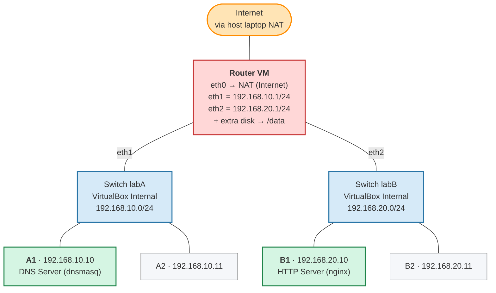

# Belajar Networking dengan Docker dan Alpine #

Lab akan terdiri dari : 

* 1 network terkoneksi ke internet
* 2 network private (`internal-a` dan `internal-b`)
* 1 VM sebagai gateway untuk membagi koneksi internet ke VM lain. 
* 2 VM sebagai anggota network `internal-a`
* 2 VM sebagai anggota network `internal-b`

Topologi jaringan adalah sebagai berikut



## Setup Internet Gateway ##

By default, network yang digunakan di virtualbox ataupun docker adalah tipe `NAT`. Semua vm di dalamnya akan otomatis terkoneksi ke internet.

1. Start Alpine Container

    ```
    docker run -d --name lab-alpine-gateway \
    --cap-add=NET_ADMIN \
    alpine sleep infinity
    ```

2. Login ke Alpine

    ```
    docker exec -it lab-alpine-gateway
    ```

3. Install package

    ```
    apk update
    apk install vim
    ```

4. Melihat semua network interface yang terdaftar

    ```
    ip a
    ```


## Membuat Private Network dengan 2 VM ##

1. Membuat network `internal-a` dengan alamat `192.168.10.0/24`

    ```
    docker network create --internal lab_internal_a
    ```

2. Membuat network `internal-a` dengan alamat `192.168.20.0/24`


    ```
    docker network create --internal lab_internal_b
    ```

3. Start VM Alpine yang connect ke network `lab_internal_a`

    ```
    docker run -d --name lab_a_1 \
    --network lab_internal_a \
    --cap-add=NET_ADMIN \
    alpine sleep infinity
    ```

4. Login ke `lab_a_1`

    ```
    docker exec -it lab_a_1 sh
    ```

5. Cek IP address di VM `lab_a_1`

    ```
    ip a
    ```

    Outputnya seperti ini

    ```
    1: lo: <LOOPBACK,UP,LOWER_UP> mtu 65536 qdisc noqueue state UNKNOWN qlen 1000
        link/loopback 00:00:00:00:00:00 brd 00:00:00:00:00:00
        inet 127.0.0.1/8 scope host lo
        valid_lft forever preferred_lft forever
        inet6 ::1/128 scope host 
        valid_lft forever preferred_lft forever
    5: eth0@if95: <BROADCAST,MULTICAST,UP,LOWER_UP,M-DOWN> mtu 1500 qdisc noqueue state UP 
        link/ether 96:82:1f:ac:80:19 brd ff:ff:ff:ff:ff:ff
        inet 192.168.107.2/24 brd 192.168.107.255 scope global eth0
        valid_lft forever preferred_lft forever
    ```

    Kita temukan bahwa:

    * IP Address sudah terisi, berarti ada DHCP server (padahal kita tidak install). Kemungkinan besar disediakan oleh Docker/Virtualbox
    * IP Address tidak sesuai dengan yang diminta dalam soal (harusnya `192.168.10.0/24`)
    * Solusinya : cek ke dokumentasi aplikasi virtualisasi yang digunakan (Docker, VMWare, ataupun Virtualbox) untuk bagaimana menentukan network address
    * Untuk docker, seharusnya pakai opsi `--subnet 192.168.10.0/24`

6. Ulang lagi untuk mendapatkan subnet yang diinginkan. Matikan semua VM yang terkoneksi ke internal network, hapus VM, kemudian hapus networknya

    ```
    docker stop lab_a_1
    docker rm lab_a_1
    docker network rm lab_internal_a
    docker network rm lab_internal_b
    ```

    Kemudian recreate `lab_internal_a` dengan subnet yang sesuai

    ```
    docker network create --internal --subnet 192.168.10.0/24 lab_internal_a 
    ```

    Lalu, recreate VM `lab_a_1`. Perintahnya sama persis dengan di atas. Tidak ada setting IP, karena otomatis disediakan oleh `lab_internal_a`. Setelah dibuat, cek lagi alamat IP. Harusnya sudah di subnet yang sesuai.

    ```
    1: lo: <LOOPBACK,UP,LOWER_UP> mtu 65536 qdisc noqueue state UNKNOWN qlen 1000
    link/loopback 00:00:00:00:00:00 brd 00:00:00:00:00:00
    inet 127.0.0.1/8 scope host lo
       valid_lft forever preferred_lft forever
    inet6 ::1/128 scope host 
       valid_lft forever preferred_lft forever
    5: eth0@if99: <BROADCAST,MULTICAST,UP,LOWER_UP,M-DOWN> mtu 1500 qdisc noqueue state UP 
        link/ether 5a:a1:10:20:92:4b brd ff:ff:ff:ff:ff:ff
        inet 192.168.10.2/24 brd 192.168.10.255 scope global eth0
        valid_lft forever preferred_lft forever
    ```

7. Pada tahap ini, seharusnya VM `lab_a_1` belum terkoneksi ke internet, bisa dibuktikan dengan ping ke gmail.com. Ini normal, karena kita belum setting gatewaynya.

8. Menambahkan network interface di VM `lab_alpine_gateway` agar terkoneksi ke network `lab_internal_a`

    ```
    docker network connect lab_internal_a lab-alpine-gateway
    ```

    Sebelum dan setelah eksekusi, cek daftar network interface di `alpine-gateway`

    Ini kondisi before

    ```
    1: lo: <LOOPBACK,UP,LOWER_UP> mtu 65536 qdisc noqueue state UNKNOWN qlen 1000
    link/loopback 00:00:00:00:00:00 brd 00:00:00:00:00:00
    inet 127.0.0.1/8 scope host lo
       valid_lft forever preferred_lft forever
    inet6 ::1/128 scope host 
       valid_lft forever preferred_lft forever
    5: eth0@if91: <BROADCAST,MULTICAST,UP,LOWER_UP,M-DOWN> mtu 1500 qdisc noqueue state UP 
        link/ether 66:98:b6:2a:80:35 brd ff:ff:ff:ff:ff:ff
        inet 192.168.215.2/24 brd 192.168.215.255 scope global eth0
        valid_lft forever preferred_lft forever
    ```

    Ini kondisi after

    ```
    1: lo: <LOOPBACK,UP,LOWER_UP> mtu 65536 qdisc noqueue state UNKNOWN qlen 1000
    link/loopback 00:00:00:00:00:00 brd 00:00:00:00:00:00
    inet 127.0.0.1/8 scope host lo
       valid_lft forever preferred_lft forever
    inet6 ::1/128 scope host 
       valid_lft forever preferred_lft forever
    5: eth0@if91: <BROADCAST,MULTICAST,UP,LOWER_UP,M-DOWN> mtu 1500 qdisc noqueue state UP 
    link/ether 66:98:b6:2a:80:35 brd ff:ff:ff:ff:ff:ff
    inet 192.168.215.2/24 brd 192.168.215.255 scope global eth0
       valid_lft forever preferred_lft forever
    6: eth1@if101: <BROADCAST,MULTICAST,UP,LOWER_UP,M-DOWN> mtu 1500 qdisc noqueue state UP 
        link/ether 4e:f4:90:2d:7d:24 brd ff:ff:ff:ff:ff:ff
        inet 192.168.10.3/24 brd 192.168.10.255 scope global eth1
        valid_lft forever preferred_lft forever
    ```

    Ada tambahan satu network interface lagi, yaitu `eth1@if101`

9. Pada titik ini, kondisinya:

    * VM `lab-alpine-gateway` punya 2 network interface dan punya 2 IP
    * VM `lab_a_1` cuma punya 1 network interface dan 1 IP
    * VM `lab-alpine-gateway` bisa ping ke internet dan juga ke `lab_a_1`
    * VM `lab_a_1` bisa ping ke `lab-alpine-gateway` tapi tidak bisa ping ke internet

10. Untuk melengkapi network pertama sesuai gambar, kita akan membuat satu VM lagi yaitu `lab_a_2`. Setelah dibuat, cek lagi konektivitas antara `lab_a_1`, `lab_a_2`, dan `lab-alpine-gateway`. Ketiga VM harusnya bisa saling ping.

    * Verifikasi di `lab-alpine-gateway`

        ```
        # ping gmail.com
        PING gmail.com (142.251.10.83): 56 data bytes
        64 bytes from 142.251.10.83: seq=0 ttl=107 time=32.964 ms
        ^C
        --- gmail.com ping statistics ---
        1 packets transmitted, 1 packets received, 0% packet loss
        round-trip min/avg/max = 32.964/32.964/32.964 ms
        / # ping 192.168.10.2
        PING 192.168.10.2 (192.168.10.2): 56 data bytes
        64 bytes from 192.168.10.2: seq=0 ttl=64 time=0.384 ms
        64 bytes from 192.168.10.2: seq=1 ttl=64 time=0.186 ms
        ^C
        --- 192.168.10.2 ping statistics ---
        2 packets transmitted, 2 packets received, 0% packet loss
        round-trip min/avg/max = 0.186/0.285/0.384 ms
        / # ping 192.168.10.4
        PING 192.168.10.4 (192.168.10.4): 56 data bytes
        64 bytes from 192.168.10.4: seq=0 ttl=64 time=0.358 ms
        64 bytes from 192.168.10.4: seq=1 ttl=64 time=0.254 ms
        ^C
        --- 192.168.10.4 ping statistics ---
        2 packets transmitted, 2 packets received, 0% packet loss
        round-trip min/avg/max = 0.254/0.306/0.358 ms
        ```
    * Verifikasi di `lab_a_1`

        ```
        / # ping 192.168.10.3
        PING 192.168.10.3 (192.168.10.3): 56 data bytes
        64 bytes from 192.168.10.3: seq=0 ttl=64 time=0.503 ms
        64 bytes from 192.168.10.3: seq=1 ttl=64 time=0.223 ms
        ^C
        --- 192.168.10.3 ping statistics ---
        2 packets transmitted, 2 packets received, 0% packet loss
        round-trip min/avg/max = 0.223/0.363/0.503 ms
        / # ping 192.168.10.4
        PING 192.168.10.4 (192.168.10.4): 56 data bytes
        64 bytes from 192.168.10.4: seq=0 ttl=64 time=0.784 ms
        64 bytes from 192.168.10.4: seq=1 ttl=64 time=0.126 ms
        ^C
        --- 192.168.10.4 ping statistics ---
        2 packets transmitted, 2 packets received, 0% packet loss
        round-trip min/avg/max = 0.126/0.455/0.784 ms
        ```

## Setup Internet Connection Sharing ##

Untuk setup internet connection sharing, perlu dilakukan di VM gateway dan semua VM yang ada di network internal/private.

Di VM gateway, kita perlu:

* Enable packet forwarding
* Setup NAT Masquerade

Di VM private, kita perlu:

* Mengarahkan internet gateway ke IP VM gateway

### Di VM lab-alpine-gateway ##

1. Enable packet forwarding di kernel

    ```
    sysctl -w net.ipv4.ip_forward=1
    ```

2. Install aplikasi `nftables` untuk setting firewall dan SNAT masquerade. Jaman dulu, ini dilakukan dengan aplikasi `iptables`. Aplikasi `nftables` adalah aplikasi baru yang menggantikan `iptables`. 

    ```
    apk add nftables
    ```

3. Dengan `iptables` kita sudah disediakan table NAT. Tapi di `nftables` kita harus buat sendiri secara manual

    ```
    nft add table ip nat
    nft add chain ip nat postrouting { type nat hook postrouting priority 100 \; }
    nft add rule ip nat postrouting oifname "eth0" masquerade
    ```

4. Cek hasil konfigurasi NAT dan Masquerade

    ```
    nft list ruleset
    ```

    Hasilnya tampil dalam format JSON seperti ini

    ```json
    table ip nat {
        chain DOCKER_OUTPUT {
            ip daddr 127.0.0.11 tcp dport 53 counter packets 0 bytes 0 xt target "DNAT"
            ip daddr 127.0.0.11 udp dport 53 counter packets 4 bytes 233 xt target "DNAT"
        }

        chain OUTPUT {
            type nat hook output priority dstnat; policy accept;
            ip daddr 127.0.0.11 counter packets 4 bytes 233 jump DOCKER_OUTPUT
        }

        chain DOCKER_POSTROUTING {
            ip saddr 127.0.0.11 tcp sport 40807 counter packets 0 bytes 0 xt target "SNAT"
            ip saddr 127.0.0.11 udp sport 42132 counter packets 0 bytes 0 xt target "SNAT"
        }

        chain POSTROUTING {
            type nat hook postrouting priority srcnat; policy accept;
            ip daddr 127.0.0.11 counter packets 4 bytes 233 jump DOCKER_POSTROUTING
        }

        chain postrouting {
            type nat hook postrouting priority srcnat; policy accept;
            oifname "eth0" masquerade
        }
    }
    ```

### Di VM lab_a_1 ###

1. Cek dulu routing bawaan

    ```
    ip route
    ```

    Outputnya seperti ini

    ```
    192.168.10.0/24 dev eth0 scope link  src 192.168.10.2 
    ```

2. Hapus default gateway bila ada

    ```
    ip route del default
    ```

3. Set default gateway ke IP VM Gateway

    ```
    ip route add default via 192.168.10.3
    ```

4. Show lagi routing table untuk memastikan konfigurasinya benar. Harusnya outputnya seperti ini

    ```
    default via 192.168.10.3 dev eth0 
    192.168.10.0/24 dev eth0 scope link  src 192.168.10.2
    ```

5. Test ping gmail lagi

    ```
    / # ping gmail.com
    ping: bad address 'gmail.com'
    ```

    Masih belum mau, tapi mungkin ini masalah DNS, bukan koneksi.

6. Coba ping ke alamat yang public (misal: alamat IP gmail yang didapat dari ping di VM gateway)

    ```
    / # ping 142.251.10.83
    PING 142.251.10.83 (142.251.10.83): 56 data bytes
    64 bytes from 142.251.10.83: seq=0 ttl=106 time=21.399 ms
    64 bytes from 142.251.10.83: seq=1 ttl=106 time=21.323 ms
    64 bytes from 142.251.10.83: seq=2 ttl=106 time=20.594 ms
    ^C
    ```

    Alamat `142.251.10.83` didapat dari hasil ping di VM gateway. Ping langsung ke IP berhasil, berarti paket datanya sudah tembus via gateway. Sekarang tinggal urusan DNS supaya bisa translate dari `gmail.com` ke IP `142.251.10.83`

7. Setting DNS di VM private ke DNS google saja (8.8.8.8)

    ```
    echo "nameserver 8.8.8.8" > /etc/resolv.conf
    ```

8. Test ping lagi ke `gmail.com`

    ```
    / # ping gmail.com
    PING gmail.com (142.251.10.17): 56 data bytes
    64 bytes from 142.251.10.17: seq=0 ttl=106 time=21.038 ms
    64 bytes from 142.251.10.17: seq=1 ttl=106 time=20.886 ms
    64 bytes from 142.251.10.17: seq=2 ttl=106 time=20.247 ms
    64 bytes from 142.251.10.17: seq=3 ttl=106 time=19.425 ms
    ^C
    ```

    Untuk memastikan, cek ke domain lain

    ```
    / # ping stmik.tazkia.ac.id
    PING stmik.tazkia.ac.id (172.67.216.248): 56 data bytes
    64 bytes from 172.67.216.248: seq=0 ttl=55 time=21.187 ms
    64 bytes from 172.67.216.248: seq=1 ttl=55 time=21.318 ms
    64 bytes from 172.67.216.248: seq=2 ttl=55 time=24.502 ms
    64 bytes from 172.67.216.248: seq=3 ttl=55 time=28.517 ms
    ^C
    --- stmik.tazkia.ac.id ping statistics ---
    4 packets transmitted, 4 packets received, 0% packet loss
    round-trip min/avg/max = 21.187/23.881/28.517 ms
    ```


# Referensi #

* [Perbandingan virtualisasi di Apple Silicon dan cara pakai Docker untuk Lab Jaringan](https://gemini.google.com/share/e465d498d58e)
* [Cara Lihat Network Interfaces di Alpine](https://gemini.google.com/share/4341df602d07)