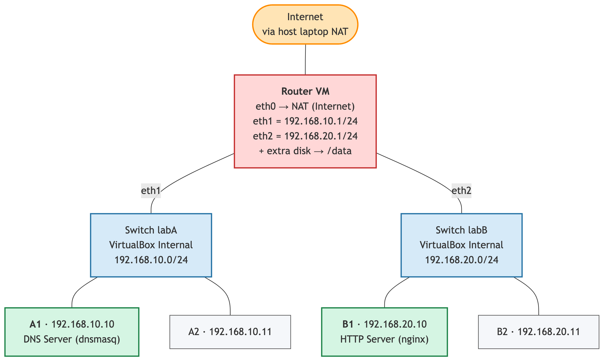

# Belajar Networking dengan Docker dan Alpine #

Lab akan terdiri dari : 

* 1 network terkoneksi ke internet
* 2 network private (`internal-a` dan `internal-b`)
* 1 VM sebagai gateway untuk membagi koneksi internet ke VM lain. 
* 2 VM sebagai anggota network `internal-a`
* 2 VM sebagai anggota network `internal-b`

Topologi jaringan adalah sebagai berikut

[](typesetting/diagram/uts-topologi.png)

## Setup Internet Gateway ##

By default, network yang digunakan di virtualbox ataupun docker adalah tipe `NAT`. Semua vm di dalamnya akan otomatis terkoneksi ke internet.

1. Start Alpine Container

    ```
    docker run -d --name lab-alpine-gateway \
    --cap-add=NET_ADMIN \
    alpine sleep infinity
    ```

2. Login ke Alpine

    ```
    docker exec -it lab-alpine-gateway
    ```

3. Install package

    ```
    apk update
    apk install vim
    ```

4. Melihat semua network interface yang terdaftar

    ```
    ip a
    ```


## Membuat Private Network dengan 2 VM ##

1. Membuat network `internal-a` dengan alamat `192.168.10.0/24`

    ```
    docker network create --internal lab_internal_a
    ```

2. Membuat network `internal-a` dengan alamat `192.168.20.0/24`


    ```
    docker network create --internal lab_internal_b
    ```

3. Start VM Alpine yang connect ke network `lab_internal_a`

    ```
    docker run -d --name lab_a_1 \
    --network lab_internal_a \
    --cap-add=NET_ADMIN \
    alpine sleep infinity
    ```

4. Login ke `lab_a_1`

    ```
    docker exec -it lab_a_1 sh
    ```

5. Cek IP address di VM `lab_a_1`

    ```
    ip a
    ```

    Outputnya seperti ini

    ```
    1: lo: <LOOPBACK,UP,LOWER_UP> mtu 65536 qdisc noqueue state UNKNOWN qlen 1000
        link/loopback 00:00:00:00:00:00 brd 00:00:00:00:00:00
        inet 127.0.0.1/8 scope host lo
        valid_lft forever preferred_lft forever
        inet6 ::1/128 scope host 
        valid_lft forever preferred_lft forever
    5: eth0@if95: <BROADCAST,MULTICAST,UP,LOWER_UP,M-DOWN> mtu 1500 qdisc noqueue state UP 
        link/ether 96:82:1f:ac:80:19 brd ff:ff:ff:ff:ff:ff
        inet 192.168.107.2/24 brd 192.168.107.255 scope global eth0
        valid_lft forever preferred_lft forever
    ```

    Kita temukan bahwa:

    * IP Address sudah terisi, berarti ada DHCP server (padahal kita tidak install). Kemungkinan besar disediakan oleh Docker/Virtualbox
    * IP Address tidak sesuai dengan yang diminta dalam soal (harusnya `192.168.10.0/24`)
    * Solusinya : cek ke dokumentasi aplikasi virtualisasi yang digunakan (Docker, VMWare, ataupun Virtualbox) untuk bagaimana menentukan network address
    * Untuk docker, seharusnya pakai opsi `--subnet 192.168.10.0/24`

6. Ulang lagi untuk mendapatkan subnet yang diinginkan. Matikan semua VM yang terkoneksi ke internal network, hapus VM, kemudian hapus networknya

    ```
    docker stop lab_a_1
    docker rm lab_a_1
    docker network rm lab_internal_a
    docker network rm lab_internal_b
    ```

    Kemudian recreate `lab_internal_a` dengan subnet yang sesuai

    ```
    docker network create --internal --subnet 192.168.10.0/24 lab_internal_a 
    ```

    Lalu, recreate VM `lab_a_1`. Perintahnya sama persis dengan di atas. Tidak ada setting IP, karena otomatis disediakan oleh `lab_internal_a`. Setelah dibuat, cek lagi alamat IP. Harusnya sudah di subnet yang sesuai.

    ```
    1: lo: <LOOPBACK,UP,LOWER_UP> mtu 65536 qdisc noqueue state UNKNOWN qlen 1000
    link/loopback 00:00:00:00:00:00 brd 00:00:00:00:00:00
    inet 127.0.0.1/8 scope host lo
       valid_lft forever preferred_lft forever
    inet6 ::1/128 scope host 
       valid_lft forever preferred_lft forever
    5: eth0@if99: <BROADCAST,MULTICAST,UP,LOWER_UP,M-DOWN> mtu 1500 qdisc noqueue state UP 
        link/ether 5a:a1:10:20:92:4b brd ff:ff:ff:ff:ff:ff
        inet 192.168.10.2/24 brd 192.168.10.255 scope global eth0
        valid_lft forever preferred_lft forever
    ```

7. Pada tahap ini, seharusnya VM `lab_a_1` belum terkoneksi ke internet, bisa dibuktikan dengan ping ke gmail.com. Ini normal, karena kita belum setting gatewaynya.

8. Menambahkan network interface di VM `lab_alpine_gateway` agar terkoneksi ke network `lab_internal_a`

    ```
    docker network connect lab_internal_a lab-alpine-gateway
    ```

    Sebelum dan setelah eksekusi, cek daftar network interface di `alpine-gateway`

    Ini kondisi before

    ```
    1: lo: <LOOPBACK,UP,LOWER_UP> mtu 65536 qdisc noqueue state UNKNOWN qlen 1000
    link/loopback 00:00:00:00:00:00 brd 00:00:00:00:00:00
    inet 127.0.0.1/8 scope host lo
       valid_lft forever preferred_lft forever
    inet6 ::1/128 scope host 
       valid_lft forever preferred_lft forever
    5: eth0@if91: <BROADCAST,MULTICAST,UP,LOWER_UP,M-DOWN> mtu 1500 qdisc noqueue state UP 
        link/ether 66:98:b6:2a:80:35 brd ff:ff:ff:ff:ff:ff
        inet 192.168.215.2/24 brd 192.168.215.255 scope global eth0
        valid_lft forever preferred_lft forever
    ```

    Ini kondisi after

    ```
    1: lo: <LOOPBACK,UP,LOWER_UP> mtu 65536 qdisc noqueue state UNKNOWN qlen 1000
    link/loopback 00:00:00:00:00:00 brd 00:00:00:00:00:00
    inet 127.0.0.1/8 scope host lo
       valid_lft forever preferred_lft forever
    inet6 ::1/128 scope host 
       valid_lft forever preferred_lft forever
    5: eth0@if91: <BROADCAST,MULTICAST,UP,LOWER_UP,M-DOWN> mtu 1500 qdisc noqueue state UP 
    link/ether 66:98:b6:2a:80:35 brd ff:ff:ff:ff:ff:ff
    inet 192.168.215.2/24 brd 192.168.215.255 scope global eth0
       valid_lft forever preferred_lft forever
    6: eth1@if101: <BROADCAST,MULTICAST,UP,LOWER_UP,M-DOWN> mtu 1500 qdisc noqueue state UP 
        link/ether 4e:f4:90:2d:7d:24 brd ff:ff:ff:ff:ff:ff
        inet 192.168.10.3/24 brd 192.168.10.255 scope global eth1
        valid_lft forever preferred_lft forever
    ```

    Ada tambahan satu network interface lagi, yaitu `eth1@if101`

9. Pada titik ini, kondisinya:

    * VM `lab-alpine-gateway` punya 2 network interface dan punya 2 IP
    * VM `lab_a_1` cuma punya 1 network interface dan 1 IP
    * VM `lab-alpine-gateway` bisa ping ke internet dan juga ke `lab_a_1`
    * VM `lab_a_1` bisa ping ke `lab-alpine-gateway` tapi tidak bisa ping ke internet

10. Untuk melengkapi network pertama sesuai gambar, kita akan membuat satu VM lagi yaitu `lab_a_2`. Setelah dibuat, cek lagi konektivitas antara `lab_a_1`, `lab_a_2`, dan `lab-alpine-gateway`. Ketiga VM harusnya bisa saling ping.

    * Verifikasi di `lab-alpine-gateway`

        ```
        # ping gmail.com
        PING gmail.com (142.251.10.83): 56 data bytes
        64 bytes from 142.251.10.83: seq=0 ttl=107 time=32.964 ms
        ^C
        --- gmail.com ping statistics ---
        1 packets transmitted, 1 packets received, 0% packet loss
        round-trip min/avg/max = 32.964/32.964/32.964 ms
        / # ping 192.168.10.2
        PING 192.168.10.2 (192.168.10.2): 56 data bytes
        64 bytes from 192.168.10.2: seq=0 ttl=64 time=0.384 ms
        64 bytes from 192.168.10.2: seq=1 ttl=64 time=0.186 ms
        ^C
        --- 192.168.10.2 ping statistics ---
        2 packets transmitted, 2 packets received, 0% packet loss
        round-trip min/avg/max = 0.186/0.285/0.384 ms
        / # ping 192.168.10.4
        PING 192.168.10.4 (192.168.10.4): 56 data bytes
        64 bytes from 192.168.10.4: seq=0 ttl=64 time=0.358 ms
        64 bytes from 192.168.10.4: seq=1 ttl=64 time=0.254 ms
        ^C
        --- 192.168.10.4 ping statistics ---
        2 packets transmitted, 2 packets received, 0% packet loss
        round-trip min/avg/max = 0.254/0.306/0.358 ms
        ```
    * Verifikasi di `lab_a_1`

        ```
        / # ping 192.168.10.3
        PING 192.168.10.3 (192.168.10.3): 56 data bytes
        64 bytes from 192.168.10.3: seq=0 ttl=64 time=0.503 ms
        64 bytes from 192.168.10.3: seq=1 ttl=64 time=0.223 ms
        ^C
        --- 192.168.10.3 ping statistics ---
        2 packets transmitted, 2 packets received, 0% packet loss
        round-trip min/avg/max = 0.223/0.363/0.503 ms
        / # ping 192.168.10.4
        PING 192.168.10.4 (192.168.10.4): 56 data bytes
        64 bytes from 192.168.10.4: seq=0 ttl=64 time=0.784 ms
        64 bytes from 192.168.10.4: seq=1 ttl=64 time=0.126 ms
        ^C
        --- 192.168.10.4 ping statistics ---
        2 packets transmitted, 2 packets received, 0% packet loss
        round-trip min/avg/max = 0.126/0.455/0.784 ms
        ```
    